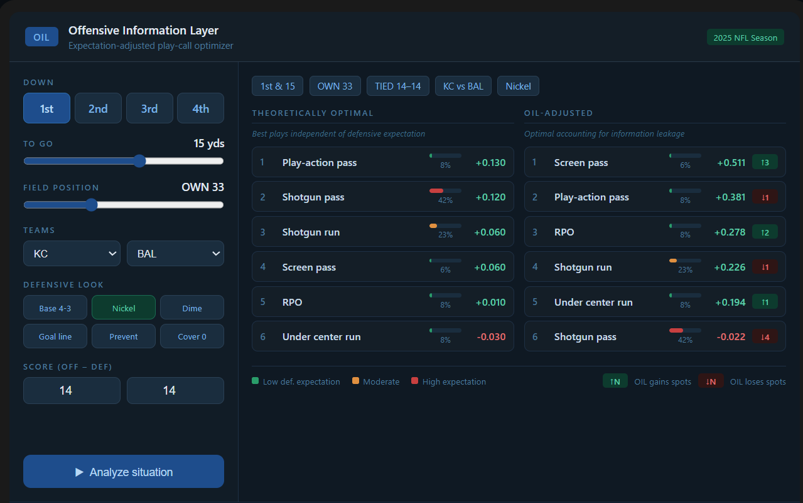

# Offensive Information Leakage (OIL)

A framework for quantifying the tradeoff between play quality and play predictability in NFL offensive decision-making.

OIL measures how much expected value an offense sacrifices when a theoretically optimal play becomes too predictable, helping identify situations where strategic unpredictability creates competitive advantage.

---

## Project Motivation

Traditional NFL analytics focuses on identifying the play with the highest expected value (often defined as EPA, or Expected Points Added) in a given situation.

However, offenses do not operate in a vacuum. Defenses form expectations based on game state, personnel, formations, and historical tendencies.

This creates a tradeoff:

- Highly effective plays become predictable.
- Predictable plays become easier to defend.
- Less optimal plays may regain value through a concealed "surprise factor".

The Offensive Information Leakage (OIL) framework attempts to quantify this tradeoff and identify when (and how often) offenses should deviate from the theoretically optimal play.

---

## Core Concept

For any game situation (down, distance, yardline, time, scoreline, teams, etc.):

1. Estimate the theoretical value of each possible play call independent of defensive expectation.
2. Estimate and scale the probability that the defense expects each play.
3. Quantify the relationship between defensive expectation and realized play value.
4. Adjust theoretical value by the cost of information leakage.

The result is an OIL-adjusted play ranking that accounts for both effectiveness and predictability.

## Example

In the above demo scenario:

- 1st-and-15
- Own 33-yard line
- Tie game
- Nickel defense

A play-action pass produces the highest theoretical EPA.

However, because shotgun pass concepts dominate offensive tendencies in this situation, defensive expectation changes the ranking.

OIL identifies screen passes and RPOs as potentially superior decisions once predictability is incorporated.
